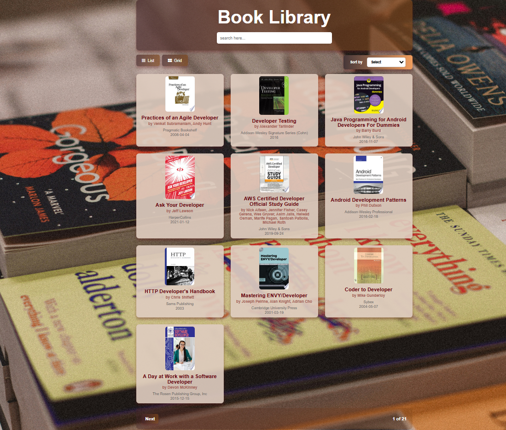
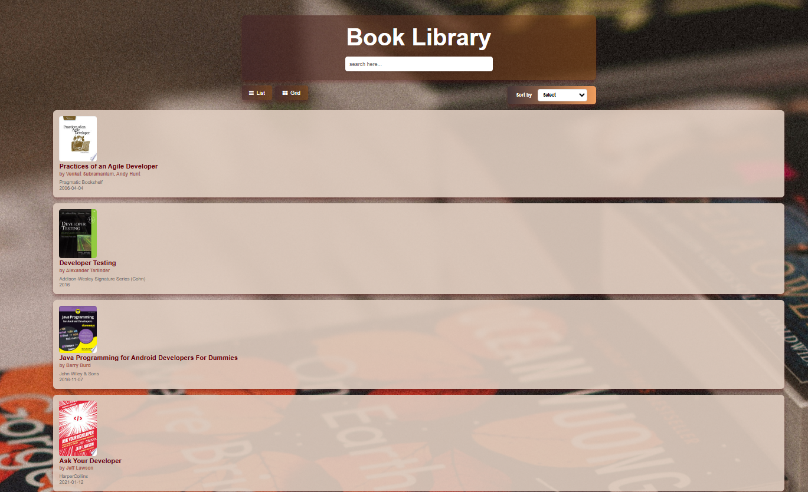

# Books Library

## Objective :

Build a Book Library website using FreeAPI.app that will fetch and display book data dynamically in a user-friendly way.

## Tech Stack

- HTML
- CSS
- JavaScript

## Features

- **Fetch Books**: Retrieve book data from the API and display it in a list or grid format.
- **Switch View**: Allow the user to toggle between list and grid view for displaying books.
- **Book Details**: Show book details including title, author(s), publisher, published date, and book thumbnail.
- **Search**: Implement a search bar to filter books by title or author.
- **Sort**: Sort books alphabetically by title in ascending and descending order & also by published date.
- **Pagination**: Pagination to display books in pages and allow navigation between them. The app supports navigating to the next and previous pages. Also, it  dynamically updates to show the current page and total pages, giving users clear feedback on their current position within the paginated content (e.g., "Page 1 of 5").
- **Book Link**: Clicking on a book item will open more details in a new tab using the provided `infoLink` from the API.

## API Endpoint

GET https://api.freeapi.app/api/v1/public/books

Documentation

https://freeapi.hashnode.space/api-guide/apireference/getBooks

## Deployment link

Deployed on Netlify:

https://book-library2.netlify.app/

## Screenshots

## Contributing

Feel free to submit issues or suggest improvements!

Developed by Monisha Sanwal
